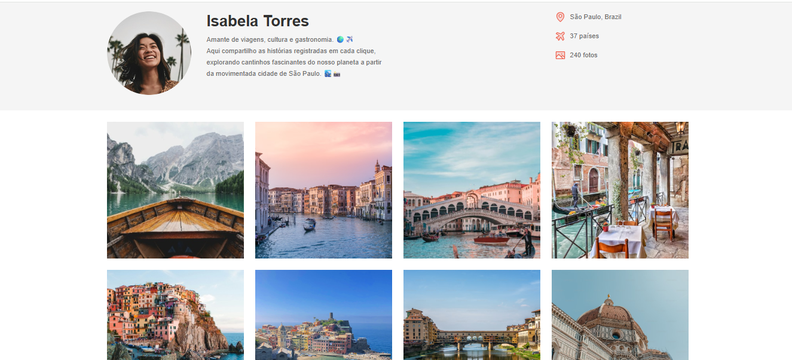

# Travelgram - Projeto de Página de Perfil de Viagens 🌍📸

Este projeto é uma simulação de uma rede social de viagens chamada **Travelgram**, criada com **HTML** e **CSS**, utilizando amplamente o **Flexbox** para o layout responsivo e alinhado dos elementos da interface.

## ✨ Objetivo

Praticar os conceitos fundamentais de **Flexbox** no CSS, construindo uma interface visualmente atrativa, organizada e responsiva, semelhante a uma rede social de viagens.

---

## 🔧 Tecnologias Utilizadas

- HTML5
- CSS3
- Flexbox

---

## 📐 Estrutura da Página

### 1. **Header**
- Logotipo da aplicação
- Barra de navegação com ícones e links ("Explorar", "Minhas Viagens")
- Localização, número de países visitados e total de fotos

### 2. **Perfil do Usuário**
- Foto de perfil
- Nome
- Descrição/Bio
- Ícones de localização e atividades

### 3. **Galeria de Fotos**
- Grade com 10 imagens de viagem organizadas com `flex-wrap` e `gap`
- Responsiva para diferentes larguras de tela

---

## 💡 Principais Propriedades Flexbox Aplicadas

- `display: flex`  
- `flex-direction: row / column`
- `justify-content: space-between | center`
- `align-items: center | stretch`
- `flex-wrap: wrap`
- `gap` para espaçamento entre fotos
- `flex: 1` para elementos com tamanhos dinâmicos


## 🚀 Como Usar

1. Clone o repositório:
   ```bash
   git clone https://github.com/seuusuario/travelgram-flexbox.git

